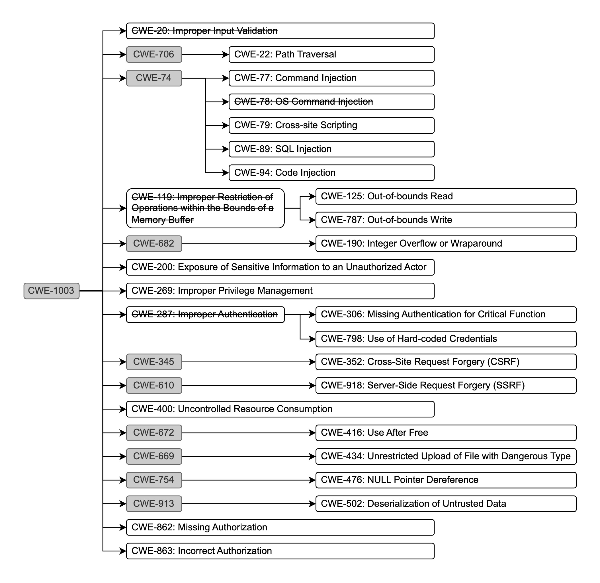

## Refining the Top 25 Most Dangerous CWE List

The MITRE Top 25 Most Dangerous CWEs provides a hierarchical structure comprising three distinct levels. However, using
these CWEs directly poses several practical issues, especially considering the official National Vulnerability
Database (NVD) guidelines. To clarify these relationships, below figure illustrates the hierarchical structure of the
Top 25 Most Dangerous CWEs. In this diagram, CWEs included in the Top 25 list are shown in white boxes, while related
but non-Top 25 CWEs are displayed in grey boxes. This diagram shows how broader, high-level CWEs relate to their more
specific, lower-level descendants.

According to NVD, second-level CWE labels are generally discouraged due to insufficient detail, as they represent
broader vulnerability categories that overlap or conflict with more precise third-level CWEs. Despite this guidance,
many practitioners continue to utilize these second-level CWEs, causing ambiguity and potential misclassification.
Specifically, some second-level CWEs included in the official Top 25 list (
like [CWE-119: Improper Restriction of Operations within the Bounds of a Memory Buffer](https://cwe.mitre.org/data/definitions/119)
and [CWE-287: Improper Authentication](https://cwe.mitre.org/data/definitions/287)) directly conflict with more detailed
third-level labels, complicating accurate and precise vulnerability identification. Moreover, upon inspecting the Top 25
CWEs in detail, we identified additional issues such as overly broad categories and frequent label confusion.

To address these concerns and to ensure comprehensive and unambiguous coverage, we performed a detailed hierarchical
analysis of the Top 25 CWE list, illustrated in the provided hierarchy figure. Based on this analysis, we:

1. **Removed ambiguous second-level CWEs** that lack sufficient detail and conflict with more precise, third-level CWEs.
   This led us to remove CWE-119 (Improper Restriction of Operations within the Bounds of a Memory Buffer) and CWE-287 (
   Improper Authentication).

2. **Resolved label confusion** between CWE-78 (OS Command Injection) and CWE-77 (Command Injection). Through manual
   inspection, we observed frequent confusion and interchangeable usage of these labels across datasets. Consequently,
   we removed CWE-78 to eliminate ambiguity and maintain clarity.

3. **Removed overly broad CWEs**, such as CWE-20 (Improper Input Validation), because our detailed inspection revealed
   that vulnerabilities labeled under CWE-20 often depended explicitly on more detailed CWEs like CWE-79 (Cross-site
   Scripting), CWE-89 (SQL Injection), and CWE-94 (Code Injection). As CWE-20 serves more as a general category of
   weaknesses rather than a specific vulnerability type, it was removed for precision.

By addressing these issues, our refined Top 25 Most Dangerous CWEs maintains 21 highly detailed and unambiguous CWEs.
This revised selection provides clearer, more accurate coverage of critical vulnerabilities, making it superior to the
original Top 25 CWE list for rigorous vulnerability analysis and benchmarking purposes.
